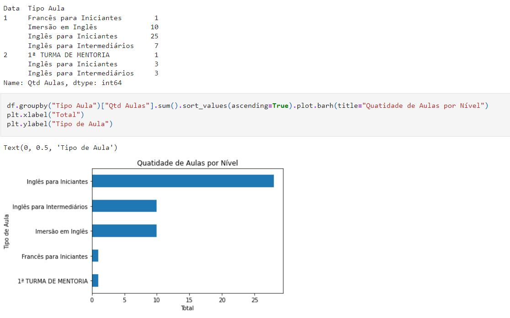

# Projeto Web Scraping

## 👩🏾‍💻 Sobre o projeto

  Esse projeto tem como objetivo uma análise exploratória de dados sobre meu histórico de aulas de inglês, na plataforma https://www.talkntalk.com.br/.

## 📚 O projeto seguiu os seguintes passos :

- Conectando a uma página da web
- Analisando html usando BeautifulSoup
- Percorrendo o objeto sopa para encontrar elementos
- Gravando dados em um csv
- Executando alguma limpeza de dados simples
- Visualização de dados

### O que é Web Scraping?

 O web scraping (raspagem de rede, em tradução livre), também conhecido como extração de dados da web, é o nome dado ao processo de coleta de dados estruturados da web de maneira automatizada. 

## 🧰 Bibliotecas Usadas
- Beautiful Soup
- Selenium
- Pandas
- Matplotlib

## 📊 Resultado :

 
  
